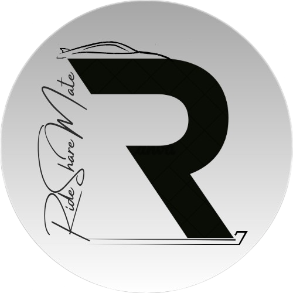

### **🚗 RideShareMate - Blockchain-Based Ride Sharing DApp**
#### **A decentralized ride-sharing platform powered by blockchain and smart contracts**





---

## **📌 Features**
✅ Decentralized ride-booking system using Ethereum  
✅ Secure payments via smart contracts  
✅ User authentication and driver verification  
✅ Transparent and immutable transaction history  
✅ Web3.js integration for blockchain interactions  

---

## **🚀 Tech Stack**
| Component  | Technology |
|------------|------------|
| **Smart Contracts** | Solidity, Truffle |
| **Blockchain** | Ethereum, Ganache |
| **Frontend** | React, Web3.js |
| **Backend** | Node.js, Express |
| **Database** | MongoDB|

---

## **📂 Project Structure**
```
RideShareMate/
│── contracts/          # Solidity smart contracts
│── migrations/         # Deployment scripts
│── userDatabase/       # Backend with Express & MongoDB
│── client/             # Frontend (React)
│── test/               # Smart contract test cases
│── truffle-config.js   # Truffle configuration
│── package.json        # Node.js dependencies
│── README.md           # Project documentation
```

---

## **🛠 Installation & Setup**
### **1️⃣ Clone the Repository**
```bash
git clone https://github.com/akash-belide/RideShareMate.git
cd RideShareMate
```

### **2️⃣ Install Dependencies**
```bash
cd userDatabase
npm install
cd ../client
npm install
```

### **3️⃣ Start Local Blockchain (Ganache)**
```bash
ganache-cli
```

### **4️⃣ Compile & Deploy Smart Contracts**
```bash
truffle compile
truffle migrate --reset
```

### **5️⃣ Start Backend Server**
```bash
cd userDatabase
node index.js
```

### **6️⃣ Run the Frontend**
```bash
cd client
npm start
```

---

## **📜 Smart Contract Overview**
- `RideShare.sol` → Handles ride booking, payments, and ratings.
- `DriverRegistry.sol` → Manages driver verification and data.
- `PassengerRegistry.sol` → Stores passenger information securely.

---

## **🔬 Testing**
To run contract tests:
```bash
truffle test
```

---

## **📜 License**
This project is licensed under the **MIT License**.


